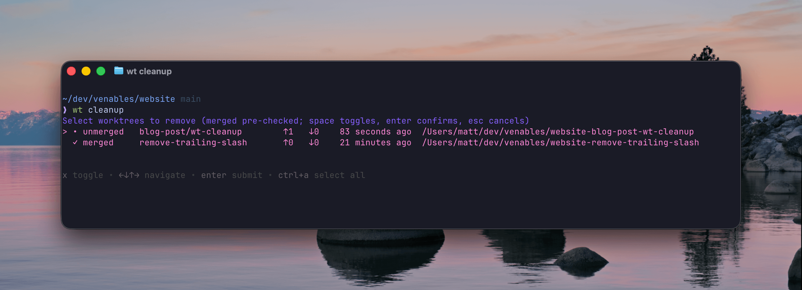

Quick follow-up to [`wt`](https://github.com/venables/wt), my git worktree
wrapper.

Spinning up worktrees is the easy part. Run a few agents in parallel for a week
and you end up with a drawer full of them. Some merged, some abandoned, a couple
you forgot you made.

So the last round of updates is about the rest of a worktree's life: tearing
them down cleanly when you're done, and running your own setup on the way in.

## wt done

This is the one I reach for constantly. You're finished with a branch, the PR's
merged, you want out:

```sh
wt done
```

It removes the worktree you're standing in and drops you back in main, in the
proper directory. One command, no path to type, no `cd`. If there are
uncommitted changes it'll stop and tell you, or `wt done -f` to force it.

That covers 90% of cleanup, right when you finish each branch.

## wt cleanup

For the other 10%, the worktrees you didn't `wt done` out of, there's the
periodic sweep. `wt cleanup` used to show a flat list and ask you to type index
numbers, so you were kinda guessing which ones were safe to delete.

Now it opens an interactive picker. Arrow keys to move, space to toggle, enter
to confirm. And every row tells you how stale the worktree actually is:

- whether the branch is merged into main
- how many commits ahead and behind main it sits
- when it last changed

```
Select worktrees to remove (merged pre-checked; space toggles, enter confirms)

  ✓ merged     old-spike      ↑0 ↓42  3 weeks ago     ../myrepo-old-spike
  ✓ merged     fix/login      ↑0 ↓11  6 days ago      ../myrepo-fix-login
  • unmerged   wip/billing    ↑3 ↓2   20 minutes ago  ../myrepo-wip-billing
```

Merged branches come pre-checked, since a branch that's already in main is the
safe one to drop. So most of the time you just hit enter. The unmerged stuff,
like the one you touched 20 minutes ago, you leave alone unless you toggle it
on.

The picker is built on [`gum`](https://github.com/charmbracelet/gum) from Charm.
Install `wt` with Homebrew and gum comes along for the ride. Grab it some other
way and cleanup falls back to the old numbered prompt, same staleness columns,
you just type the numbers.

## Hooks, on both ends

The first post copied your `.env` files into a new worktree. Now you can run
real commands. Drop an executable script at
`~/.config/wt/hooks/post-worktree-add` and `wt` runs it right after creating the
worktree:

```sh
# ~/.config/wt/hooks/post-worktree-add
#!/usr/bin/env bash
set -euo pipefail
cd "$WT_PATH"
pnpm install --frozen-lockfile
```

So `wt feature/login` can hand you a worktree that's already installed and ready
to run, not just one with the files copied over. Install deps, trust your mise
config, seed a scratch database, whatever the repo needs to boot.

There are matching hooks on the way out too (`pre-` and `post-worktree-remove`),
so `wt done` and `wt cleanup` can tear down whatever you set up. Each hook gets
`WT_PATH`, `WT_BRANCH`, `WT_REPO_ROOT`, and `WT_REPO_NAME` in its environment.

## Upgrade

```sh
brew upgrade wt
```

Run `wt doctor` to confirm gum got picked up.

[Repo's on GitHub.](https://github.com/venables/wt)
