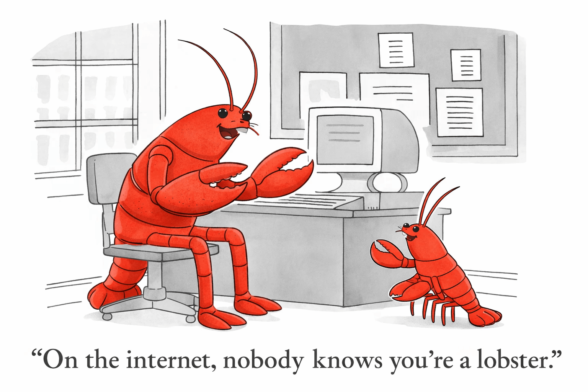

_A follow-up to
[Your Agent Needs an Identity. And It Should Be Decentralized.](https://venabl.es/your-agent-needs-an-identity)_

---

A few months ago, I wrote about
[why AI agents need decentralized, cryptographic identity](https://venabl.es/your-agent-needs-an-identity).
My argument was simple: agents are going to be acting on your behalf across the
internet, so they'll need a way to prove who they are without leaking your
personal information.

I still believe all of that. But something has shifted underneath the premise,
and it's worth talking about.

## My agent is me

When I wrote that post, the mental model was: your agent runs in the cloud,
talks to APIs, and acts _on your behalf_. It needs credentials, permissions,
identity — everything to prove it should be there — because it's operating
remotely, autonomously, in cloud environments that don't know you.

That was the trajectory. And for enterprise and cloud-native agents, it still
is.

But the thing that actually happened (and I didn't see this coming) is that
agents started running on your Mac Mini. On your home machine. Logged into your
browser. Using your cookies, your OAuth tokens, your everything. Not acting _on
your behalf_ in some delegated sense. Acting _as you_.

[OpenClaw](https://openclaw.ai) is probably the best example of this shift. It
runs on your machine, connects to your messaging apps, browses the web in your
browser sessions, reads your files, manages your calendar — all using your
existing credentials. It didn't wait for an identity layer. It just shipped. And
it works remarkably well precisely because it sidesteps the identity problem
entirely. Your agent doesn't need to prove it's authorized to use your Gmail —
it's already logged in. **It's not operating on your behalf. It _is_ you.**

[Claude Code](https://docs.anthropic.com/en/docs/claude-code) and a growing wave
of similar tools are doing the same thing. It's same pattern again: agents are
inheriting their operator's identity by default.

This is incredibly pragmatic — and in hindsight, inevitable. Why would we expect
every service on the internet to drop everything and support agents natively,
especially while the entire definition of "agent" is rapidly evolving? So here
we are.

## But Your Agent Still Needs an Identity

So if agents are just running as you, why bother with identity at all? Because
the moment you have more than one agent, "it was me" stops being a useful
answer. And the reasons only grow from there.

### Cryptographic Guardrails

Right now, if your agent is running with your credentials, it can do _anything
you can do_. Send emails. Delete files. Make purchases. Post on social media.
There's no granularity.

Cryptographic identity fixes this. Give your agent a keypair, issue it signed
credentials that scope its permissions, and now it can't accidentally spend
money because it can't cryptographically sign the transaction. The agent can't
escalate its own permissions because it can't forge the signature. Least
privilege, enforced by math instead of a config file.

And if the credential is _bound_ to the agent via cryptographic proof then even
if the agent fumbles the credential and exposes it, nobody else can use it.

### The Audit Trail

If you're running one agent, identity is simple. You know who did it. Done.

When you have two or three — a coding agent, a personal assistant, something
monitoring your email — things get murky. Which one sent that message? Which one
made that API call that burned through your rate limit? OpenClaw alone can spawn
sub-agents for different tasks. When you've got multiple agents operating with
the same credentials, "show me the receipts" becomes a real need.

And once agents start touching money — making purchases, managing subscriptions,
executing transactions — you need a clear, auditable trail of which agent did
what, when, and under what authority. This is where identity infrastructure like
[ACK-ID](https://www.agentcommercekit.com/ack-id/introduction), or a variation
of it, becomes a pain-killer rather than a vitamin.

## SSL: Yes, that analogy again

In my original post, I compared agent identity to SSL certificates for the web.
That comparison holds up even better now.

SSL didn't launch with the web. The early web was plaintext everything. HTTP,
not HTTPS. And it worked fine — until it didn't. Until people started doing
commerce, entering passwords, transmitting sensitive data. Then SSL went from
"nice to have" to "the browser literally won't let you visit this site without
it."

Agents are in their HTTP era right now. Everything is running on ambient trust —
your credentials, your machine, your implicit authorization. And it works great.
OpenClaw users aren't losing sleep over agent identity. They're getting things
done.

But agents are about to start doing commerce. Making purchases. Managing money.
Coordinating with other agents they've never interacted with before. Your agent
will need to verify that it's really dealing with Amazon's agent and not a
phishing agent. Amazon's agent will need to verify that your agent is authorized
to make purchases on your behalf. Ambient trust stops being enough.

The tools for this already exist. It's just cryptography -- keypairs and
signatures, the same primitives we already use for everything else. Protocols
like ACK-ID package this up for agents. The question is just about _when_ we
start using them.

## What I Think Happens Next

Bear with me while I speculate a bit, I'm only an oracle-in-training. Here's how
I imagine it goes down:

**Short term (now):** Agents continue running locally with ambient credentials.
Identity is implicit. The ecosystem grows fast because there's zero friction.

**Medium term:** Multi-agent setups become common. People want audit trails,
permission scoping, and the ability to distinguish between agents. Local
identity — even if it's just "this agent has a keypair and signs its actions" —
starts to matter. Agent runtimes begin building this in.

**Long term:** Cloud-based agent explosion. Personal agents will still run
locally, but corporate agents won't be running on Mac Minis. Agent-to-agent
communication scales up. The external trust problem from my original post comes
roaring back, but now there's a foundation of local identity to build on.

The thing I missed in my original post wasn't the destination — it was the path.
I assumed agents would need identity _first_, as a prerequisite for operating.
Instead, they're operating first and identity is following. Which is, if you
think about it, exactly how the internet has always worked.

## So ... keypairs?

Your agent still needs an identity. And the cryptographic foundation is simpler
than it sounds. Forget the jargon — DIDs, VCs, W3C — nobody cares about the spec
name. It's just keypairs and signatures.

Give your agent a keypair. Sign its actions. Build audit trails. Scope
permissions with signed credentials. Start local. Extend outward.

We're in a golden age of agent development, one we'll look back upon with
nostalgia, but your agents are running around wearing your clothes. Sure, it's
pragmatic for now, but soon we'll want to know which one is which.

---

_At [Catena Labs](https://catenalabs.com), we're building agent-native financial
infrastructure on top of the [Agent Commerce Kit](https://agentcommercekit.com).
The identity layer —
[ACK-ID](https://www.agentcommercekit.com/ack-id/introduction) — is designed for
exactly this evolution: from local agent identity to internet-scale trust. If
you're building in this space, [let's talk](https://catenalabs.com/)._
