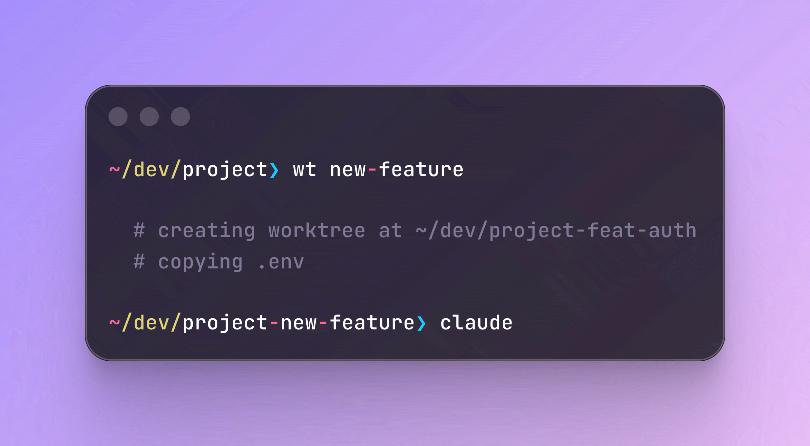

Git worktrees are having a moment. With tools like
[Claude Code](https://code.claude.com), [opencode](https://opencode.ai), and
[Amp](https://ampcode.com), you can run multiple coding agents in parallel. But
they step on each other's toes when they run in the same directory (and I'm
looking for maximum efficiency here!)

Git worktrees are a clean way to give each agent its own space but they suffer
from a major problem: they don't copy over `.env` (and other gitignored) files,
so you can't test the changes without some manual setup.

So I created a git worktree wrapper called
[`wt`](https://github.com/venables/wt).



## What it does

```sh
# Create a worktree for an existing branch
wt feature/login

# Worktree ends up at ../myproject-feature/login
```

It handles the path for you and copies over everything that was in your
`.gitignore`. Worktrees live at `../<repo>-<branch>`, which keeps them organized
and out of the way. And you can have it auto-cd you into the new worktree
directory, too.

A few other commands:

```sh
# List worktrees
wt ls

# Clean up
wt rm feature/login
```

## .worktreeinclude

Building on what Claude Desktop (oddly not Claude Code, yet) and Cline already
promote, `wt` supports a `.worktreeinclude` file, which is the same format as
`.gitignore` but allows you to copy over just a subset of items.

Create a `.worktreeinclude` file to specify what gets copied:

```
.env
.env.local
```

If the file doesn't exist, `wt` falls back to copying everything in `.gitignore`
that exists in the source worktree. If you don't want any files copied, you can
always opt-out with `--no-copy`.

## Bonus: Even more speed

Add a `wtc` function to your `.zshrc` or `.bashrc` that creates a worktree and
launches Claude Code in one go:

```sh
wtc() { wt "$@" && claude; }
```

## Install

```sh
brew install venables/tap/wt
```

[Check out the repo on GitHub.](https://github.com/venables/wt)
