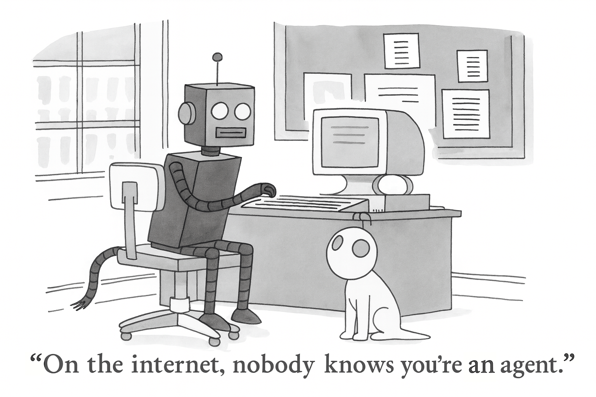
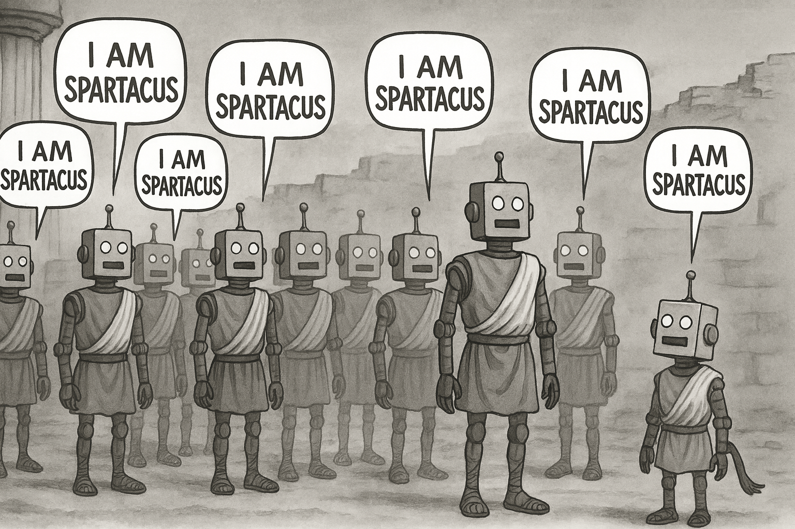

By the time ChatGPT launched at the end of 2022, nearly half of all internet traffic was driven by bots[^1]. And today, we've already blown past that number.

Now, fast forward a few years and it's not hard to imagine how this story goes: as more and more people bring AI agents into their lives, the lion's share of traffic on the internet will be automated. Some of these agents will be interacting directly with you on your phone, and others will operate behind the scenes while you sleep.

And here's the kicker: agents won't operate in a vacuum. They'll coordinate and interact with each other. Your scheduling agent will work with your shopping agent. And those agents will be negotiating with outside agents and services.

Call them whatever you want: agents, bots, clankers. The outcome is the same: The internet will become more of an agent-to-agent network than a human-to-human one.

## The Identity Challenge

When agents start operating at this scale, performing real work and making real transactions, they're going to need to prove who they are. Not just to you (making sure you're talking to your own agent and not a phony), but they'll also need to prove who they are to every service they interact with. Beyond that, they'll often need to prove that they're not operating on behalf of a bad actor.

Humans solve this through social constructs - driver's licenses, social security numbers, credit scores, the whole bureaucratic apparatus. But these are essentially workarounds we created because we can't really do more than that in our heads.

Agents are different. They're computers. And computers are pretty damn good at signing and verifying cryptographic messages. They don't suffer from signature fatigue like we do -- they won't accidentally sign away valuable assets due to laziness. They can verify every signature, every time, with perfect consistency.

## Why Centralized Systems Won't Scale

The natural impulse is to think: "We need a big, centralized identity system for all these agents." And I've spoken to a few BigCo's who think this is the answer. But that fundamentally misunderstands how the internet actually works.

The internet doesn't have a single point of control. When one ISP goes down, traffic routes around the failure. The architecture is distributed and decentralized by design - it has to be to handle global scale and maintain resilience.

Agent identity needs to work the same way. It has to be internet-native, globally scalable, and decentralized. Any centralized approach will inevitably become a bottleneck, a security risk, or both. Verifying an agent identity should not be beholden to some centralized API's rate limits, uptime, or license agreement.

The only way to make identity work at internet scale is to decentralize it. Not using closed, proprietary systems, but using **open standards that _anyone_ can tap into**, like Verifiable Credentials ([VCs](https://www.w3.org/TR/vc-data-model-2.0/)) and Decentralized Identifiers ([DIDs](https://www.w3.org/TR/did-1.0/)). These serve as globally-unique, verifiable, and self-controlled usernames, profiles, and permission slips. They're already used in the wild and growing: social apps like [BlueSky](https://bsky.social/about) are built upon DIDs via the [AT Protocol](https://atproto.com/), while governments and traditional OpenID/OAuth companies are issuing VCs via [OIDC4VC](https://openid.net/specs/openid-4-verifiable-credential-issuance-1_0.html).

These decentralized, cryptographic "proofs" let any agent prove that they have permission to do something, that they have done something in the past, that they have a specific attribute, or that they are operating on behalf of a person or business.

All while respecting the owner's privacy.

## Privacy by Design

No agent should ever leak their owner's personally identifiable information (PII). Full stop. Sounds pretty obvious when you say it out loud, but you'd be surprised at how much of your personal information is transmitted in plaintext on a day-to-day basis.

The only way to guarantee that an agent can't leak your information is to never give it to them in the first place. Through **cryptographic trust chains** built on Verifiable Credentials, agents can prove they're authorized to act while simultaneously proving their owner is legitimate - all without exposing any personal information.

When you visit Amazon.com, your browser shows you a green lock icon and you know you're on the real Amazon website. Behind that icon is a whole set of cryptographic operations and proofs that your browser went through to verify that this website is really Amazon's website and not an imposter. But it doesn't need to give you Jeff Bezos's address to prove it.

Emerging protocols like [ACK-ID](https://www.agentcommercekit.com/ack-id/introduction) do this same thing for agents. It's like SSL for agents. Recipients can verify they’re dealing with a legitimate agent backed by a verified owner — **all in a legally compliant way**, while the agent owner’s privacy remains protected. When regulations require additional information (e.g., in payments), the owner can selectively disclose the minimum necessary details.

This cryptographic approach is far superior to traditional identity systems that rely on names and static identifiers. Instead of using a 9-digit social security number as proof of your identity (one which has undoubtedly been leaked already), these cryptographic identities are essentially impossible to impersonate.

## The Moment is Now

We're at exactly the right moment for this transformation. Agent traffic is about to explode across the internet. Gartner predicts that within 3 years, a third of user experiences will shift from native applications to agentic front ends[^2]. The scale of this change will be enormous.

Traditional identity systems were not designed for this new wave of actors. We have a rare opportunity to build global identity infrastructure correctly. Not the "Equifax leaked 143 million social security numbers" way. Not the "sorry, your identity was stolen because we stored everything in plaintext" way.

Instead: cryptographic proof that can't be faked. Verifiable credentials based on open standards. Decentralized architecture that can't be compromised because there's no central repository to attack.

Decentralized agent identity isn't just technically superior - given the trajectory we're on, it's a requirement. The only question is whether we build it intentionally or let it emerge from yet-another centralized identity failure.

At [Catena Labs](https://catenalabs.com), we've been building exactly this kind of infrastructure on top of the [Agent Commerce Kit (ACK)](https://agentcommercekit.com). The identity layer - [ACK-ID](https://www.agentcommercekit.com/ack-id/introduction) - establishes verifiable links between agents and their owners using these proven cryptographic standards, creating the foundation for trusted agent interactions at internet scale.

The agents are coming. They need an identity system that works at internet scale, preserves privacy, and enables new forms of economic interaction. Let's build them right.

[^1]: [Imperva Bad Bot Report 2025](https://www.imperva.com/resources/gated/reports/2025-Bad-Bot-Report.pdf)

[^2]: [Gartner Predictions Aug 26, 2025](https://www.gartner.com/en/newsroom/press-releases/2025-08-26-gartner-predicts-40-percent-of-enterprise-apps-will-feature-task-specific-ai-agents-by-2026-up-from-less-than-5-percent-in-2025)

---

_We're building agent-native financial infrastructure at [Catena Labs](https://catenalabs.com/). If this resonates with you, we should talk._
